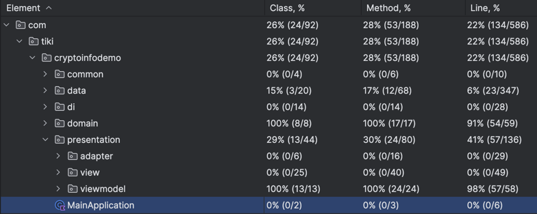

# Assignment

Thanks for the opportunity to work on this assignment~

Function checklist:
- [x] Reusable CurrencyListFragment
- [x] Different UI for Crypto and Fiat currencies, normal and search states
- [x] Empty state for CurrencyListFragment search page
- [x] CurrencyListFragment search functionality: filter by name, code, and symbol
- [x] Cancelable search function
- [x] Buttons on MainActivity: Insert, Delete, Crypto source, Fiat source, All
- [x] Fetching Fiat and Crypto data from the network
- [x] Unit Test + Instrumented Test(for DAO) with good coverage(viewmodel, repositories, usecases 100%
class coverage)

## Project Structure

Clean Architecture + MVVM

**Data Layer:**

- Repository implementations
- Network request
- Database operations

**Domain Layer:**

- UseCases: Business logic
- Repository interfaces
- Models

**Presentation Layer:**

- ViewModels: UI<->data linking logic
- View: Fragment, Activity, Adapters...

## Libraries

- Dependency Injection: Koin
- Database: Room
- Asynchronous Tasks: Coroutines
- Network: Retrofit, OkHttp
- UI: ViewBinding, View based UI,
- Testing: JUnit, Mockk, Truth, Turbine

## Testing

**Test Coverage:**
Highlights:

- ViewModels 100% classes coverage
- Repositories 100% classes coverage
- UseCases: 100% classes coverage

Details:

## Video

[Screen_recording_20240421.webm](Screen_recording_20240421.webm)

## APK

[app-debug.apk](app-debug.apk)
